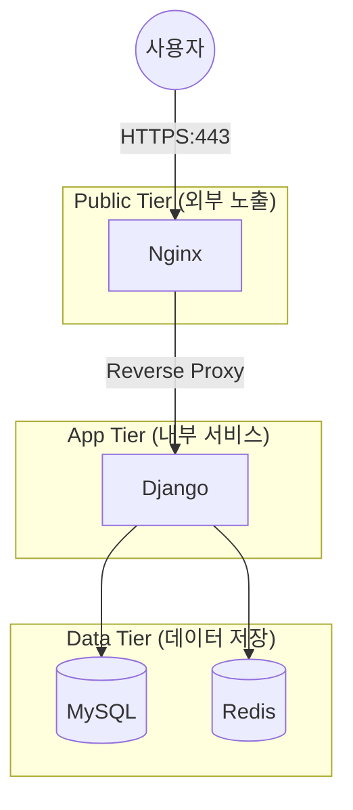

# AImFin 배포 가이드 (Baseline v1.0)

이 문서는 AImFin 프로젝트의 **배포 베이스라인(1차 운영 환경)**을 설명합니다.
Docker Compose로 `Nginx(게이트웨이) + Django(백엔드) + MySQL/Redis(데이터 계층)`을 구성했고, **외부 노출을 최소화하고 HTTPS를 적용**해 운영 환경에 가까운 형태로 검증했습니다.
또한 누구나 쉽게 실행하고 검증할 수 있도록 정리되었습니다.

---

## 1. 전체 아키텍처 (구조도)

AImFin은 보안을 위해 서비스를 아래 세 개의 계층(Tier)으로 분리하여 관리합니다.
* **Public Tier (외부 노출)**: Nginx (유일한 진입점)
* **App Tier (내부 서비스)**: Django Backend(Gunicorn)
* **Data Tier (데이터 저장)**: MySQL, Redis



### 핵심 설계 전략
1.  **외부 노출 최소화**: 외부 사용자는 오직 `Nginx`를 통해서만 서비스에 접속할 수 있습니다. `DB`나 `Redis`는 외부에서 직접 접속이 불가능하도록 내부망(`private-net`)에만 존재합니다.
2.  **보안 통신 (HTTPS)**: 모든 데이터는 암호화된 통신을 통해 안전하게 전송됩니다.

---

## 2. 주요 보안 설정

어려운 용어 대신, 어떤 보호 장치를 적용했는지 중심으로 설명합니다.

| 분류 | 내용 | 목적 |
| :--- | :--- | :--- |
| **HTTPS(암호화 통신)** | Nginx에서 인증서 적용 후 HTTPS 제공 | 전송 중 데이터 노출 방지 |
| **HTTP → HTTPS 리다이렉트** | 80으로 들어오면 443으로 자동 이동                 | 실수로 HTTP로 접속해도 안전하게 유도  |
| **보안 헤더** | HSTS(Strict-Transport-Security), X-Frame-Options(SAMEORIGIN), X-Content-Type-Options(nosniff) 적용 | 웹 공격 기본 방어 (HTTPS 강제, 클릭재킹 방지, MIME 스니핑 방지) |
| **Non-root 실행** | 백엔드 컨테이너를 일반 사용자(appuser)로 실행  | 서버 침투 시 관리자(Root) 권한 탈취 방지/피해 범위 축소 |
| **(추후 강화)** | CSP(Content-Security-Policy)                                                                     | 허가되지 않은 외부 스크립트 실행 차단(향후 적용 예정)     |

---

## 3. 실행 및 검증 방법

### 1) AI 서비스 설정
백엔드가 AI 엔진(Gemini 2.0 등)과 안전하게 통신하기 위해 아래 변수를 설정합니다.
* `AI_PROVIDER`: `gemini` 또는 `openai`
* `GEMINI_API_KEY`: Google AI Studio에서 발급받은 키
* `GEMINI_MODEL`: `gemini-2.0-flash` (권장)
* `GMS_BASE_URL`: (GMS Proxy 사용 시) 프록시 서버 주소

---

## 4. 운영 단계 검증 (Monitoring Verification)

배포 후 AI 서비스가 정상적으로 '신뢰성 모델'로 동작하는지 확인합니다.

### 1) 실시간 로그 모니터링
컨테이너 로그에서 `[AI_METRICS]`, `[GUARDRAIL]`, `[SUCCESS]` 태그가 출력되는지 확인하여 AI 호출의 지연시간과 무결성을 점검합니다.
```bash
docker compose logs -f backend | grep "\[AI_METRICS\]"
```

### 3) 정상 작동 확인 (스모크 테스트)
서비스가 켜진 후, 아래 명령어로 주요 체크포인트를 자동으로 점검합니다.
```bash
sh tests/smoke_test.sh
```
*(성공 시 모든 항목이 green 'PASS'로 표시됩니다.)*
* **리다이렉트**: `http://localhost` → `301`로 `https://localhost` 이동 확인
* **HTTPS 연결**: `https://localhost` 접속(인증서 경고는 개발용이라 예외 처리)
* **정적 파일 서빙**: `/static/admin/css/base.css` → `200 OK`
* **Admin 프록시**: `/admin/login/` 연결 성공 (Nginx → Django 프록시 확인)

---

## 3. 트러블슈팅 (문제 해결 기록)

### 1) 브라우저에서 `ERR_TOO_MANY_REDIRECTS` 발생

**증상**: `https://localhost/admin/` 접속 시 리다이렉트가 무한 반복되어 페이지가 열리지 않음

**원인**:
Nginx가 HTTPS를 처리(TLS 종료)한 뒤 Django로는 내부 통신(HTTP)으로 전달하는데, Django가 “원래 요청이 HTTPS였다”는 정보를 모르고 **HTTP로 착각**하여 `SECURE_SSL_REDIRECT`가 반복적으로 동작함.

**해결**:
Django가 프록시(Nginx)가 전달하는 `X-Forwarded-Proto` 정보를 신뢰하도록 설정함.

```python
SECURE_PROXY_SSL_HEADER = ("HTTP_X_FORWARDED_PROTO", "https")
```

---

### 2) 정적 파일(CSS/이미지)이 보이지 않음

**원인 후보**:

* `collectstatic`이 수행되지 않았거나
* Nginx의 `/static` 경로(alias)가 올바르지 않거나
* 볼륨(static-volume)에 파일이 없는 경우

**해결(운영 자동화)**:
컨테이너 시작 시 `collectstatic`을 수행하도록 환경변수 기반 실행을 추가함.

* `RUN_COLLECTSTATIC=true`